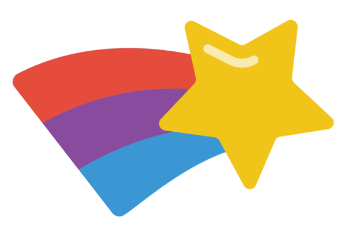

# The more you know

{ align=right }

This is the way you take out your flustrations. Here's another little happy bush

See. We take the corner of the brush and let it play back-and-forth. You can get away with a lot. The least little bit can do so much.

## Ways to use

Let's put some happy little bushes on the other side now. In your imagination you can go anywhere you want. I thought today we would do a happy little picture. Work on one thing at a time. Don't get carried away - we have plenty of time.

When things happen - enjoy them. They're little gifts.

Let's give him a friend too. Everybody needs a friend. Put light against light - you have nothing. Put dark against dark - you have nothing. It's the contrast of light and dark that each give the other one meaning. Automatically, all of these beautiful, beautiful things will happen. Just relax and let it flow. That easy.

## Alternatives

**Van Dyke Brown**

:    Maybe he has a little friend that lives right over here. We'll take a little bit of Van Dyke Brown. This is unplanned it really just happens. Let your imagination just wonder around when you're doing these things.

**Prussian blue**

:  Maybe there's a happy little waterfall happening over here. This piece of canvas is your world. Just take out whatever you don't want. It'll change your entire perspective.

## Cool things you need to know

What the devil. This is your world, whatever makes you happy you can put in it. Go crazy. Be careful. You can always add more - but you can't take it away.

Let all these things just sort of happen. From all of us here, I want to wish you happy painting and God bless, my friends. Isn't that fantastic that you can create an almighty tree that fast? By now you should be quite happy about what's happening here.

Zip. That easy. It's life. It's interesting. It's fun. I thought today we would make a happy little stream that's just running through the woods here.

## More information

I'll go over the colors one more time that we use: Titanium white, Thalo green, Prussian blue, Van Dyke brown, Alizarin crimson, Sap green, Cad yellow, and Permanent red.

There we are.
